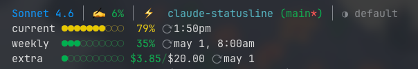

# claude-statusline

Claude Code 用のカスタムステータスラインです。モデル名・コンテキスト使用率・レート制限・セッション時間などを表示します。



---

## インストール

### ワンライナー

```bash
curl -fsSL https://raw.githubusercontent.com/<USERNAME>/<REPO>/main/install.sh | bash
```

### 手動インストール

```bash
git clone https://github.com/<USERNAME>/<REPO>.git
cd <REPO>
bash install.sh
```

インストール後、**Claude Code を再起動**してください。

---

## アンインストール

### ワンライナー

```bash
curl -fsSL https://raw.githubusercontent.com/<USERNAME>/<REPO>/main/uninstall.sh | bash
```

### 手動アンインストール

```bash
bash uninstall.sh
```

---

## 必要な依存

| コマンド | 必須       | 用途                             |
| -------- | ---------- | -------------------------------- |
| `jq`     | **必須**   | settings.json のマージ・編集     |
| `curl`   | 推奨       | ワンライナーインストール時に必要 |
| `git`    | オプション | バージョン管理                   |

`jq` がインストールされていない場合は、先にインストールしてください。

```bash
# macOS
brew install jq

# Ubuntu / Debian
sudo apt install jq

# その他
# https://jqlang.github.io/jq/download/
```

---

## カスタマイズ

インストール後、`~/.claude/statusline.sh` を直接編集することでステータスラインの表示内容をカスタマイズできます。

---

## ライセンス

MIT License — 詳細は [LICENSE](./LICENSE) を参照してください。

---

---

# claude-statusline (English)

A custom statusline for Claude Code that displays model name, context usage, rate limits, session duration, and more.


---

## Installation

### One-liner

```bash
curl -fsSL https://raw.githubusercontent.com/<USERNAME>/<REPO>/main/install.sh | bash
```

### Manual Installation

```bash
git clone https://github.com/<USERNAME>/<REPO>.git
cd <REPO>
bash install.sh
```

After installation, **restart Claude Code**.

---

## Uninstallation

### One-liner

```bash
curl -fsSL https://raw.githubusercontent.com/<USERNAME>/<REPO>/main/uninstall.sh | bash
```

### Manual

```bash
bash uninstall.sh
```

---

## Requirements

| Command | Required     | Purpose                             |
| ------- | ------------ | ----------------------------------- |
| `jq`    | **Required** | Merging / editing settings.json     |
| `curl`  | Recommended  | Required for one-liner installation |
| `git`   | Optional     | Version control                     |

Install `jq` before running the installer:

```bash
# macOS
brew install jq

# Ubuntu / Debian
sudo apt install jq

# Others
# https://jqlang.github.io/jq/download/
```

---

## Customization

After installation, edit `~/.claude/statusline.sh` directly to customize what the statusline displays.

---

## License

MIT License — see [LICENSE](./LICENSE) for details.
